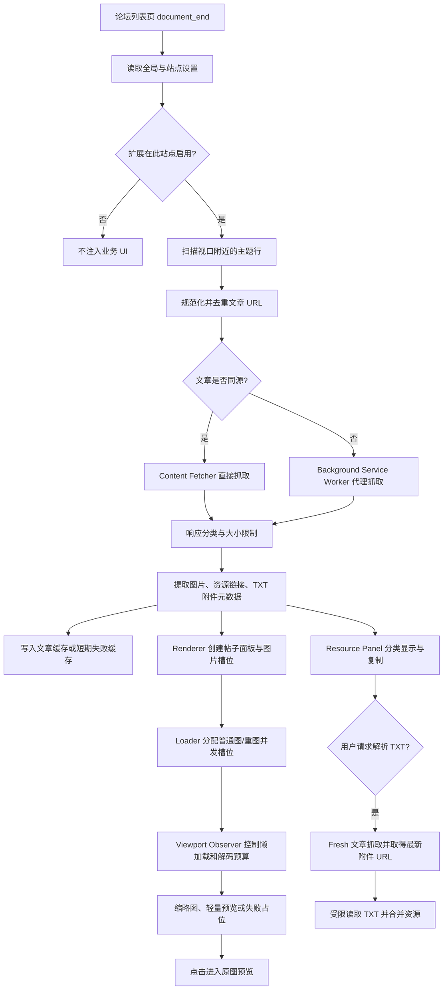
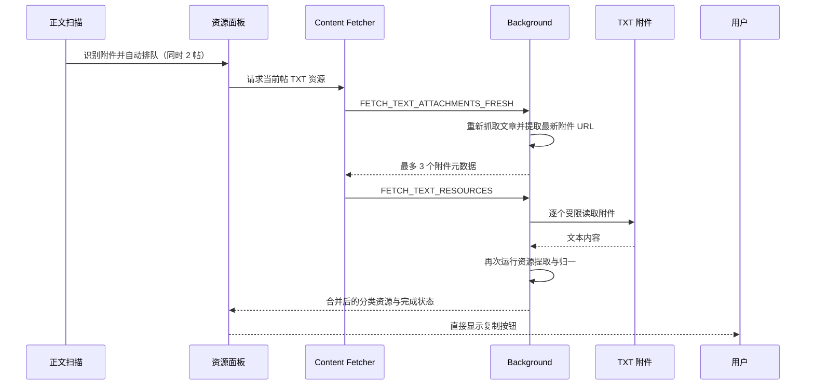

# 文章缩略图预览：插件技术总览

> 文档历史基线：v1.16.3；当前仓库版本：v1.17.3。本文架构说明未逐段重新审定，当前安装和验证以 [README.md](README.md) 为准。  
> 更新日期：2026-07-17  
> 适用对象：代码评审者、后续维护者、测试人员和开源协作者  
> 说明：v1.16.3 在页面会话读取基础上增加 TXT 自动 FIFO、显式完成缓存和迟到结果隔离；成功直接复制，失败才显示手动兜底。图片调度、权限、缓存 key/TTL 和复制格式保持兼容。

## 1. 项目定位

“文章缩略图预览”是一个 Chrome / Edge Manifest V3 扩展。它运行在受支持的 Discuz 论坛列表页中，自动读取帖子正文里的图片和资源信息，并把结果直接展示在帖子列表中。

扩展解决的核心问题有三类：

1. 不进入帖子详情页，也能先看图片缩略图，快速判断帖子内容。
2. 面对单帖几十到数百张图片时，保持首屏优先、滚动流畅和后台持续推进，不通过偷偷降低用户设置的抓取或显示上限换取性能。
3. 在列表页直接汇总 ED2K、磁力、网盘、压缩包、Torrent 和 TXT 附件中的资源链接，并正确绑定提取码与解压密码。

当前实现的基本边界如下：

| 项目 | 当前实现 |
|---|---|
| 扩展规范 | Manifest V3 |
| 支持浏览器 | Chrome、Microsoft Edge 及兼容 Chromium 浏览器 |
| 页面运行范围 | `https://*.sehuatang.org/*`、`https://*.sehuatang.net/*` |
| 跨域抓取范围 | 论坛域名，以及 Manifest 明确列出的附件域名 |
| 扩展权限 | 仅 `storage` |
| 数据存储 | 本机 `chrome.storage.local` |
| 远程服务 | 无自建服务器，不上传帖子正文、图片 URL、资源链接或日志 |
| 第三方依赖 | 运行时无第三方依赖，项目验证不依赖 npm 包 |
| 当前版本 | v1.16.3，真实视口优先调度，并支持 TXT 自动解析、完成缓存与失败兜底 |

## 2. 功能分类

项目目前按职责分为以下九类能力：

| 分类 | 用户可见能力 | 主要实现 |
|---|---|---|
| 帖子扫描 | 在论坛列表页识别真实主题行，跳过公告、版务和无效链接 | `scanner.js`、`content.js` |
| 文章抓取 | 同源直接抓取，跨域交给后台抓取；慢请求不会堵住整批文章 | `fetcher.js`、`background.js` |
| 图片提取 | 从 Discuz 常见属性、懒加载属性、`srcset` 和页面元数据中提取候选图 | `shared-utils.js`、`fetcher.js` |
| 缩略图加载 | 首屏优先、后台续载、视口懒加载、失败补位、图床退避 | `loader.js`、`viewport-observer.js` |
| 重图优化 | 高分辨率图床独立并发、解码预算、轻量缩略、离屏卸载和可见恢复 | `loader.js`、`viewport-observer.js` |
| 资源提取 | ED2K、磁力、百度、夸克、阿里、115、普通下载链接分类与复制 | `shared-utils.js`、`resource-panel.js` |
| TXT 解析 | 用户按需重新取得临时附件地址，受限读取 TXT 并二次提取资源 | `fetcher.js`、`background.js`、`resource-panel.js` |
| 设置与维护 | 页面悬浮面板、popup、站点禁用、缓存/日志维护、热重载 | `settings-schema.js`、`floating-panel.js`、`popup.js` |
| 验证与发布 | 静态守护、沙箱回归、资源夹具、真实浏览器 smoke、白名单打包 | `tests/`、`tools/` |

## 3. Manifest V3 架构

### 3.1 运行上下文

扩展由三个相互配合的运行上下文组成：

| 上下文 | 能做什么 | 不能做什么 |
|---|---|---|
| Content Script | 扫描页面、读取当前页面 DOM、同源抓取、渲染缩略图和资源 UI | 不能直接抓取不满足页面同源策略的文章或附件 |
| Background Service Worker | 校验消息来源、代理允许域名的跨域文章/TXT 抓取、串行维护共享缓存索引 | 不直接操作论坛页面 DOM |
| Popup / 页面悬浮面板 | 读取和保存设置、启停扩展、站点禁用、清缓存、查看和导出日志 | 不承担图片主调度 |

Content Script 按 Manifest 中的固定顺序加载：

1. `settings-schema.js` 定义设置。
2. `defaults.js` 和 `config.js` 负责默认值、归一化和站点配置。
3. `shared-utils.js` 提供跨模块常量、URL、图片、资源和缓存索引工具。
4. `logger.js`、`cache.js` 提供内容脚本侧日志与缓存。
5. `scanner.js`、`fetcher.js` 负责发现和抓取文章。
6. `viewport-observer.js`、`loader.js` 负责图片加载与重图预算。
7. `resource-panel.js`、`renderer.js`、`previewer.js` 负责用户界面。
8. `floating-panel.js` 和 `content.js` 完成设置面板与页面总编排。

这种顺序是运行时依赖关系的一部分，不能随意重排。

### 3.2 完整数据链



## 4. 初始化、扫描与页面生命周期

### 4.1 初始化

`content.js` 在 `document_end` 启动，读取标准化设置，检查总开关和当前站点配置，然后创建唯一的页面悬浮入口。悬浮设置面板使用开放式 Shadow DOM 隔离样式；页面中每个标签页只允许存在一个 `#bfp-root`。

初始化完成后，内容脚本会同时监听：

- 初次列表扫描。
- 滚动后的视口附近补扫。
- Discuz 异步插入主题行时的 `MutationObserver`。
- 设置保存后的 live、hot reload 或 page reload。
- 标签页 `visibilitychange`。
- `pagehide/pageshow` 与 BFCache 返回。

### 4.2 增量扫描

扫描不是一次性遍历整页，而是有预算地持续推进：

| 扫描参数 | 当前值 | 目的 |
|---|---:|---|
| 正文队列高水位 | 默认 5，可调 1–100 | 控制待抓取 job 的补位水位 |
| 单轮 DOM 节点预算 | 120 | 限制长列表查询成本 |
| 候选缓存目标 | 50 | 减少连续批次重复查找 |
| 正文预取距离 | 默认 2000px，可调 0–50000px | 提前准备即将进入视口的帖子 |
| 深滚定位回退 | 8 行 | 从视口附近开始，同时保留少量上文 |
| 普通扫描节流 | 1200ms | 合并密集滚动触发 |
| 正文提交批量 | 默认 2，可调 1–32 | 可见帖立即提交，离屏帖分帧提交 |

`scanner.js` 会优先寻找 `#threadlist`、`.threadlist` 等高可信容器，并在后续批次复用仍有效的根节点。只有根节点脱离文档或结构失效时才重新探测，避免反复做全页面选择器查询。

“跳过置顶/版务帖”由用户控制，默认开启。过滤基于主题行结构、URL 规则和公告、版务、规则、服务大厅等关键词，不改变普通主题识别。

### 4.3 文章抓取补位池

同源文章和跨域文章共用流式 job 池，worker 数由 `articleFetchConcurrency` 控制，默认 3、范围 1–32。每个 worker 完成当前 URL 后立即领取下一个 URL，完成一篇就提交一篇，因此慢文章只占一个 worker，不会阻塞其他已完成结果。

后台单条消息最多接收 60 个文章 URL，并再次执行来源与目标域名白名单校验。该上限是消息安全边界，不是用户“抓取上限”设置，两者含义不同。

### 4.4 响应边界

| 边界 | 当前值 |
|---|---:|
| 单篇文章响应体上限 | 2 MiB |
| HTML 解析字符上限 | 1,000,000 字符 |
| 纯 DOM 图片提取输入上限 | 300,000 字符 |
| 后台单次 URL 数 | 60 |
| 后台文章 worker | 读取 `articleFetchConcurrency`，默认 3、范围 1–32 |
| 单篇正文抓取超时 | 读取 `articleTimeout`，默认 15 秒、范围 1–180 秒 |

HTTP 200 并不一定代表有效帖子。实现会保守识别 Discuz 登录、权限、购买、下载拦截页，以及 HTTP 401、403、429、5xx 等临时失败。明确的拦截页会作为“可重试空结果”，不会写成长期有效的“无图片文章”。

## 5. 图片候选提取与渲染

### 5.1 候选优先级

单个图片节点按以下优先级选取最可信地址：

1. `.zoom[file]` / `img[file]`。
2. `data-original`。
3. `data-src`。
4. `srcset` 中的最佳候选。
5. `src`。
6. 页面 `og:image`。

提取后会统一做绝对 URL 解析、无效协议过滤、站点装饰图过滤、重复归一和同节点变体去重。一个 `img` 节点尽量只保留一个最佳候选，避免同一图片的缩略版和原图被重复加载。

### 5.2 抓取上限、显示上限与补位候选

两个用户设置保持独立：

- “抓取上限”决定从帖子正文保留多少个图片候选，默认 100，可调 10–500。
- “显示上限”决定最多创建多少个可见缩略图，默认 100，可调 10–500。

实际显示数量为：

```text
effectiveDisplay = min(抓取上限, 显示上限)
```

当抓取上限大于显示上限时，普通图和混合图帖子会保留少量隐藏候选，只在当前缩略图失败时用于原槽位补位。隐藏候选不会扩大用户设置的显示数量。实现没有额外把 100 或 500 改成更低硬上限。

### 5.3 帖子级渲染

`renderer.js` 为每篇文章维护独立线程状态，包含候选、当前槽位、资源、加载完成度、重图模式和扫描代际。缩略图网格的列数、行数、宽高和间距都由设置生成；合法的 `gridGap=0` 会被保留。

缩略图支持鼠标和键盘打开大图预览。`previewer.js` 使用 modal dialog 语义、焦点限定、Esc 关闭、左右切换，并在关闭后恢复原焦点。

## 6. 大量图片下的调度链路

### 6.1 三类任务

加载器把图片任务分为：

| 通道 | 任务来源 | 默认并发 |
|---|---|---:|
| 普通首屏 | 每帖前 `gridCols × visibleRows` 个普通槽位 | 3 |
| 普通后台 | 首屏之后、视口续载和失败补位 | 1 |
| 重图 | 已识别高分辨率重图图床的任务 | 2 |

“后台加载速度”控制普通后台任务之间的启动间隔：

| 模式 | 间隔 |
|---|---:|
| 极速 | 20ms |
| 很快 | 50ms |
| 快速 | 100ms |
| 平衡 | 300ms |
| 温和 | 800ms |

### 6.2 核心槽位公式

总 active 槽位由公开设置控制：

```text
totalActiveLimit = globalImageConcurrency > 0
  ? globalImageConcurrency
  : 弱图可见并发 + 重图并发
```

同时，普通任务仍单独受普通通道并发限制。这两个条件必须同时成立：

- 自动模式不再因后台并发较小而缩小总槽；后台并发只限制离屏普通图通道。
- 默认弱图可见并发 3、重图并发 2 时，总槽为 5，两个通道可同时达到自己的 ceiling。
- 用户显式设置总并发时，该值就是普通图与重图合计 ceiling。
- 提高普通并发不会绕过重图 host 健康保护。
- 提高重图并发也不会挤占普通任务的独立上限。

混合场景使用公开的“普通图保留槽位”：`heavyAvailable = min(重图有效 ceiling, 总槽位 - 尚需保留的普通槽位)`。保留槽位可设为 0，不存在均衡 1、轻量 3 等隐藏 ceiling。

可见优先使用独立的 `viewportPriorityReservedSlots`。离屏弱图的 admission 只计算普通图 active，并限制为 `max(1, 总槽位 - 可视保留槽)`；重图仍按独立 heavy ceiling 调度，真实可见弱图和手动重试可使用完整 `firstScreenConcurrency`（界面名称“弱图可见并发”）。因此离屏图不会抢满弱图容量，也不会因保留策略完全停止。

### 6.3 视口 pending

即将进入视口但暂时没有槽位的图片进入 pending 集合。其上限动态计算：

```text
pendingLimit = viewportPendingLimit > 0
  ? viewportPendingLimit
  : max(普图后台并发 × 8, 首屏可见槽位 × 3, 24)
```

该预算让大图列表可以持续预取，又避免 IntersectionObserver 一次把数百个节点全部送进主队列。重试扫描每轮也有独立数量预算，避免 pending 集合越大、每次滚动越卡。

### 6.4 图床健康与失败恢复

普通图床和重图图床分别维护页内健康状态：

| 保护 | 普通图床 | 重图图床 |
|---|---|---|
| 基础 host 槽位 | `ordinaryHostConcurrency` | `heavyImageConcurrency` ceiling |
| 降速阈值 | soft/hard 阈值及目标并发可调 | 失败窗口、阈值、warmup/probe 均可调 |
| 冷却 | 可调；可关闭普通 host 自适应 | 基础/最大冷却可调；熔断可关闭 |
| 恢复 | 连续成功后逐步恢复 | 连续成功后逐步恢复 |

首屏任务有优先级，但不会绕过同 host 保护。OPEN 重图 host 的离屏任务继续 deferred；可见图和手动重试只能在公开 probe 并发、重图 ceiling 与全局总槽范围内探测。每个重图任务在同一 host 健康代际最多贡献一次失败，fallback 不重复放大；请求启动时记录代际，恢复前启动的迟到失败不会污染恢复后的窗口，成功恢复同时清零指数冷却计数。这样坏图床只消耗有限槽位，其他正常图床仍可继续加载。

图片失败恢复还包括：

- 当前 URL direct 加载失败后，获得一次独立的 no-referrer 重试机会。
- no-referrer fallback 使用当前任务剩余超时窗口，不受之前排队时间影响。
- 切换到新的候选 URL 后，新候选重新获得自己的 fallback 机会。
- 用户“图片超时”默认 15 秒，可调 1–180 秒；重图专用超时为 0 时完整继承该值。
- 冷却只控制 admission 和探针，不缩短用户超时；可选任务总期限独立配置，0 表示不限。
- 当前槽位失败时可从保留候选中补位；全重图坏链还会跳跃采样候选后段，避免只验证前几十条坏链。

## 7. 重图优化

### 7.1 判定

当前重图识别针对已知高分辨率、高扇出的图片 host。候选集合至少包含 3 张重图，并且重图占比达到 50% 时，线程进入重图优化路径。关闭“重图优化”后，所有图片回到统一展示逻辑。

### 7.2 两种清晰度模式

| 模式 | 展示策略 | 解码策略 |
|---|---|---|
| 均衡 | 每帖优先展示一行代表图，失败时从抓取候选继续补位 | 在清晰图和毛玻璃预览间按预算切换 |
| 轻量缩略 | 按普通图的显示数量展示 | 保留最长边 160px 的 canvas 预览，原图按行分批启动 |

轻量缩略只影响列表页缩略图细节，点击仍打开原图预览。它不会修改抓取上限或显示上限。

### 7.3 解码与可见区预算

浏览器卡顿通常不只来自网络请求，还来自高分辨率图片的内存占用、解码和缩放。重图链路因此同时控制“张数”和估算像素量 MP：

| 预算 | 当前值 |
|---|---:|
| 范围内清晰重图保留 | 默认 8 张，0 表示不限 |
| 范围内清晰重图预算 | 默认 160MP，0 表示不限 |
| 可见区压力预算 | 默认 180MP，0 表示不限 |
| 派生软预算 | 按公开 MP ceiling 比例计算 |
| 单批卸载 | 最多 4 张 |
| 轻量预览最长边 | 默认 160px，可调 |
| 轻量预热范围 | 至少 2400px，或约 4 个视口高度 |

当用户滚动时，新重图启动和清晰恢复会暂缓；滚动停止后再按低压或高压批量恢复。离屏较远的清晰原图可以释放 `src`，保留轻量预览，重新接近视口时再恢复。

可见毛玻璃如果长期受 MP 预算阻挡，会进入饥饿兜底。默认等待 8 秒后允许把上限放宽到 820MP；等待范围为 0–120 秒，上限范围为 0–10000MP，0 表示不使用对应上限。低压恢复批量默认 2、高压恢复批量默认 1，两项范围均为 1–128；界面同时显示更保守的建议上限供起步参考。

这些预算是解码保护，不会截断候选列表，也不会把用户设置的抓取或显示上限改小；公开 ceiling 设为 0 时不启用对应上限。

## 8. 资源链接提取

### 8.1 已分类资源

资源在标准化后按固定顺序展示：

| 内部类型 | 显示分类 | 典型内容 |
|---|---|---|
| `ed2k` | ED2K | `ed2k://...` |
| `magnet` | 磁力 | `magnet:?xt=urn:btih:...` |
| `baidu` | 百度网盘 | pan.baidu.com 分享链接 |
| `quark` | 夸克网盘 | pan.quark.cn 分享链接 |
| `aliyun` | 阿里云盘 | aliyundrive.com / alipan.com 分享链接 |
| `pan115` | 115 网盘 | 115.com 分享链接 |
| `other` | 其他链接 | ZIP、RAR、7z、Torrent 和其他可下载 URL |

### 8.2 提取来源

解析器同时读取三种信息，而不是只对整段 HTML 做一个正则：

1. 正文可见文本，用于发现裸 URL、ED2K、磁力、密码提示。
2. Anchor 的真实 `href`，用于恢复被显示文本截断或包装的链接。
3. Anchor 周围的局部文本上下文，用于把访问码绑定到最近的对应网盘链接。

解析后执行：

- HTML entity 和常见编码还原。
- 协议相对 URL、裸域名和缺少 `https://` 的常见网盘地址补全。
- 中文逗号、句号、括号等尾部标点清理。
- URL 规范化与重复去除。
- `pwd`、`password`、`code` 等 query 参数优先识别为访问码，再从最终分享 URL 中移除。
- 链接类型分类和稳定排序。

### 8.3 访问码绑定规则

访问码只允许绑定百度、夸克、阿里、115 等网盘类型。绑定使用链接局部上下文，并在遇到下一条链接时建立边界：

```text
百度链接 A + 提取码 1234 + ZIP 链接 B
=> 1234 只属于百度链接 A
=> ZIP 链接 B 不继承 1234
```

这条规则同时防止：

- 一篇帖子中的第一个提取码传播到后面所有链接。
- 网盘访问码误附着到 ZIP、Torrent、ED2K 或磁力。
- 另一个网盘链接附近的访问码串到前一条链接。

解压密码与访问码分开保存。解压密码可以包含特殊符号，标准化后最多保留 5 个，并在用户开启“复制时附带密码”时加入复制结果。

## 9. TXT 附件资源

TXT 附件在正文识别完成后进入独立低并发队列，不占图片加载器槽位；单帖附件串行读取，自动失败后才开放手动兜底：



安全和性能边界：

| 项目 | 当前值 |
|---|---:|
| 单帖处理 TXT 数量 | 最多 3 个 |
| 自动线程并发 | 每页最多 2 帖；每帖附件串行 |
| 后台消息并发 | 扩展级最多 2 条 TXT 资源消息 |
| 整轮共享时限 | 1/2/3 个附件约 33/53/73 秒，包含页面会话、直接读取和后台回退预算 |
| 单附件大小 | 最大 512 KiB |
| 单附件超时 | 10 秒 |
| 后台消息输入附件数 | 最多检查 30 个输入，最终仍只处理 3 个 |
| 失败缓存 | 5 分钟 |

Discuz 临时附件 URL 可能带时效签名，因此不会把易过期原始 URL 写进普通文章缓存。自动解析或手动重试时通过 `FETCH_TEXT_ATTACHMENTS_FRESH` 重新抓文章，取得最新地址。持久链接和可复用签名链接可以进入 TXT 缓存；文章缓存另存可选的完成/未解析计数，避免部分成功被误判完成；缓存 key 使用 hash，不把原始附件 URL 直接暴露在 storage key 中。

## 10. 全部用户设置

### 10.1 生效语义

设置 schema 统一使用三种应用模式：

| 模式 | 含义 |
|---|---|
| `live` | 保存后立即读取新值，不清空当前主队列 |
| `hotReload` | 只销毁并重建缩略图/资源业务链路，不刷新整个论坛页面 |
| `pageReload` | 用于总开关和站点禁用等页面级状态，需要整页重新初始化 |

旧的 `immediate` 字段仍保留兼容映射。普通显示与加载设置保存后走 hot reload，不会再先重建一次、随后又整页刷新。

### 10.2 显示

| 设置 key | 界面名称 | 默认值 | 可调范围 | 生效 |
|---|---|---:|---:|---|
| `gridCols` | 每行列数 | 5 | 1–32 | hotReload |
| `visibleRows` | 可见行数 | 2 | 1–20 | hotReload |
| `thumbWidth` | 缩略图宽度 | 110px | 60–320px | hotReload |
| `thumbHeight` | 缩略图高度 | 82px | 50–240px | hotReload |
| `gridGap` | 图片间距 | 6px | 0–20px | hotReload |

首屏槽位数始终由“每行列数 × 可见行数”计算。默认值为 5 × 2 = 10 张。

### 10.3 加载

| 设置 key | 界面名称 | 默认值 | 可调范围/选项 | 生效 |
|---|---|---:|---|---|
| `maxImagesPerPost` | 抓取上限 | 100 | 10–500 | hotReload |
| `maxDisplayPerPost` | 显示上限 | 100 | 10–500 | hotReload |
| `firstScreenConcurrency` | 弱图可见并发 | 3 | 1–128 | live |
| `viewportPriorityReservedSlots` | 可视范围保留槽位 | 2 | 0–128 | live |
| `backgroundConcurrency` | 普图后台并发 | 1 | 1–128 | live |
| `backgroundSpeed` | 后台加载速度 | 平衡 300ms | 20/50/100/300/800ms | live |
| `imageTimeout` | 图片超时 | 15000ms | 1000–180000ms | live |
| `pauseWhenHidden` | 标签页不可见时暂停 | 开 | 开/关 | hotReload |
| `skipServiceThreads` | 跳过置顶/版务帖 | 开 | 开/关 | hotReload |
| `heavyImageOptimization` | 重图优化 | 开 | 开/关 | hotReload |
| `heavyImageConcurrency` | 重图并发 | 2 | 1–128 | live |
| `heavyThumbnailClarity` | 重图缩略清晰度 | 均衡 | 均衡/轻量缩略 | hotReload |
| `heavyPreviewStarvationWait` | 重图兜底等待 | 8 秒 | 0–120 秒 | live |
| `heavyPreviewStarvationMP` | 重图兜底上限 | 820MP | 0–10000MP | live |
| `heavyRestoreFastBatchSize` | 重图低压恢复批量 | 2 | 1–128 | live |
| `heavyRestorePressureBatchSize` | 重图高压恢复批量 | 1 | 1–128 | live |

### 10.4 高级

| 设置 key | 界面名称 | 默认值 | 可调范围 | 生效 |
|---|---|---:|---:|---|
| `maxRetryPerImage` | 单图重试次数 | 0 | 0–20 | hotReload |
| `debugLogging` | 调试日志 | 关 | 开/关 | live |
| `cacheTTL` | 缓存时间 | 30 分钟 | 1–1440 分钟 | hotReload |

### 10.5 专家调优

“专家调优”默认折叠。下表中的建议上限只用于提示，不参与运行时截断；保存值只受同一行公开的 schema 范围约束。

| 设置 key | 界面名称 | 默认值 | 可调范围/选项 |
|---|---|---:|---|
| `articleFetchConcurrency` | 正文抓取并发 | 3 | 1–32 |
| `articleQueueHighWatermark` | 正文队列高水位 | 5 | 1–100 |
| `articleTimeout` | 正文抓取超时 | 15000ms | 1000–180000ms |
| `articlePrefetchDistance` | 正文预取距离 | 2000px | 0–50000px |
| `articleCommitBatchSize` | 正文提交批量 | 2 | 1–32 |
| `globalImageConcurrency` | 图片全局总并发 | 0 | 0–256，0 为自动 |
| `ordinaryHostConcurrency` | 普通图同域并发 | 6 | 1–128 |
| `ordinaryHostAdaptive` | 普通图同域自适应 | 开 | 开/关 |
| `ordinaryHostSoftLimit` | 普通图软降载并发 | 2 | 1–128 |
| `ordinaryHostHardLimit` | 普通图硬降载并发 | 1 | 1–128 |
| `ordinaryHostSoftFailures` | 普通图软降载阈值 | 3 | 1–100 |
| `ordinaryHostHardFailures` | 普通图硬降载阈值 | 6 | 1–100 |
| `ordinaryHostCooldownMs` | 普通图同域冷却 | 30000ms | 0–600000ms |
| `ordinaryHostRecoverySuccesses` | 普通图恢复成功数 | 3 | 1–100 |
| `viewportPendingLimit` | 视口待加载上限 | 0 | 0–2000，0 为自动 |
| `backgroundDelayMs` | 后台自定义间隔 | -1 | -1–5000ms，-1 使用速度预设 |
| `heavySchedulingMode` | 重图调度模式 | 自适应 | 自适应/固定并发 |
| `heavyCircuitBreaker` | 重图图床熔断 | 开 | 开/关 |
| `heavyWarmupConcurrency` | 重图起始并发 | 2 | 1–128 |
| `heavyProbeConcurrency` | 重图探针并发 | 1 | 1–128 |
| `ordinaryReservedSlots` | 普通图保留槽位 | 2 | 0–128 |
| `ordinaryFallbackLimit` | 普通图单槽候选回退 | 2 | 0–50 |
| `heavyImageTimeout` | 重图单候选超时 | 0 | 0–180000ms，0 继承图片超时 |
| `heavyFailureThreshold` | 重图连续失败阈值 | 6 | 1–100 |
| `heavyFailureWindowMs` | 重图失败时间窗 | 60000ms | 1000–600000ms |
| `heavyCooldownBaseMs` | 重图基础冷却 | 20000ms | 0–600000ms |
| `heavyCooldownMaxMs` | 重图最大冷却 | 60000ms | 0–1800000ms |
| `heavyRampSuccesses` | 重图升槽成功数 | 2 | 1–100 |
| `heavyRecoverySuccesses` | 重图恢复成功数 | 2 | 1–100 |
| `heavyFallbackLimit` | 重图单槽候选回退 | 2 | 0–50 |
| `imageTaskDeadline` | 图片任务总期限 | 0 | 0–900000ms，0 表示不限 |
| `heavyDecodedBudgetMP` | 重图附近解码预算 | 160MP | 0–10000MP，0 表示不限 |
| `heavyVisibleBudgetMP` | 重图可见区预算 | 180MP | 0–10000MP，0 表示不限 |
| `heavyDecodedImageLimit` | 清晰重图数量上限 | 8 | 0–128，0 表示不限 |
| `heavyLightweightPreviewEdge` | 轻量缩略最长边 | 160px | 32–1024px |

### 10.6 资源

| 设置 key | 界面名称 | 默认值 | 可调范围 | 生效 |
|---|---|---:|---:|---|
| `showResourcePanel` | 显示资源栏 | 开 | 开/关 | hotReload |
| `copyPasswordsWithLinks` | 复制时附带密码 | 开 | 开/关 | live |

共 60 个 schema 设置。所有 number 设置保存时都会按公开的 min、max 和 step 做归一；默认值只在用户未保存有效值时回退，不覆盖已有用户配置。运行时策略不会再应用更小的隐藏 ceiling。

## 11. 缓存、退避与恢复

### 11.1 缓存分类

| 数据 | 前缀/键 | 主要用途 |
|---|---|---|
| 图片 URL | `thumb_cache_v2_` | 兼容已有已加载图片记录 |
| 文章结果 | `article_cache_v9_` | 图片、资源和完整状态 |
| TXT 资源 | `txt_resource_cache_v2_` | 可复用 TXT 解析结果 |
| TXT 失败 | `atp_text_fail_v1_` | 5 分钟内避免重复失败请求 |
| 空文章负缓存 | `atp_empty_v8_` | 5 分钟内避免反复抓取确认空结果 |
| 缓存索引 | `atp_cache_index_v1` | 统计、清理和 LRU 淘汰 |
| 清理代际 | `atp_cache_generation_v1` | 防止清理前启动的异步任务回写 |

文章缓存 TTL 默认 30 分钟，由用户在 5–120 分钟范围内调整。只有完整抓取并完成必要处理的文章结果才作为完整缓存命中；截断、拦截页或可重试空结果不会伪装成长期有效的空文章。

### 11.2 容量与淘汰

缓存按约 10 MiB 的项目预算管理：

- 达到约 85% 时启动淘汰。
- 淘汰目标回落到约 75%。
- 优先使用 `cacheIndex` 统计，必要时从 storage 重建。
- Content 和 Background 写入缓存值后，通过 Background 作为主要写入者串行更新索引。
- 索引批量更新失败会异步合并为一次重建，不改变已经成功写入的缓存值。

### 11.3 清缓存竞态

用户清缓存时，popup 会在清理前后推进 generation。文章抓取、TXT 解析、负缓存、renderer 补写和 loader 延迟 flush 都携带任务开始时间；真正写入前后会再次检查 generation。

这样可以阻止以下竞态：

```text
旧抓取开始 -> 用户清缓存 -> 旧抓取稍后完成
```

旧任务会因代际过期停止写回，不会让用户刚清空的缓存重新出现。相同 key 的旧清理任务也会核对当前 storage 值的所有权，避免误删已经写入的新值。

### 11.4 页面恢复

- 标签页隐藏且用户开启暂停时，后台图片任务暂停；返回可见后继续。
- BFCache 返回时通过 `pageshow.persisted` 恢复 observer、timer 和未完成图片状态。
- 仍有有效 `src/currentSrc` 的 active 图片会继续等待，不会立即被误判失败。
- hot reload 会用新的链路代际使旧任务失效，再只重建扩展自己的 UI，不刷新论坛页面。

## 12. 日志与诊断

DEBUG 默认关闭。关闭时，`loader.js` 和 `viewport-observer.js` 会在热路径入口跳过昂贵诊断快照构造；INFO、WARN 和 ERROR 仍保留。

日志容量：

| 日志 | 当前预算 |
|---|---:|
| Content 全部会话 | 约 2 MiB |
| 单个 Content 分片 | 约 160 KiB |
| Content 分片数 | 最多 20 |
| 单会话记录数 | 最多 800 |
| Background 日志 | 约 512 KiB |

Content 日志按页面会话使用独立 key。高频图片/渲染事件约每 2 秒合并为 `diagnostic_summary`，失败、fallback、retry 和恢复错误仍保留明细。

诊断可以区分：

- 请求真的慢，还是任务在首屏/后台/重图队列中等待。
- 普通 host 或重图 host 是否降速、冷却。
- 视口 pending 是否堆积、图片是否快速滚动后离屏。
- 重图是否因可见 MP、范围 MP、滚动或恢复批量而暂缓。
- fallback 是候选耗尽、host 冷却、超时，还是 no-referrer 路径。

日志写入和导出都会脱敏 URL：移除 query 和 hash、限制长度；TXT 缓存 key 也不直接包含原始 URL。导出保留 UTC、本地时间、时区和结构化字段，便于跨日问题定位。

## 13. 权限、隐私与安全边界

Manifest 权限只有：

```json
{
  "permissions": ["storage"]
}
```

Host permission 是精确白名单，不使用 `<all_urls>`。所有跨上下文抓取消息都会同时校验发送页面来源和目标 URL；后台一次接收的 URL/附件数量、响应大小和超时均有限制。

扩展不会：

- 上传页面正文、图片或资源链接。
- 读取或导出 Cookie、账号密码和 localStorage。
- 绕过登录、验证码、购买或回复可见限制。
- 加载远程 JavaScript。
- 在 Manifest 未允许的页面运行。

同源 fetch 会由浏览器按当前登录会话正常携带 Cookie；这只是读取用户当前本来可访问的页面，不扩大账号权限。

## 14. 测试体系

### 14.1 静态与沙箱验证

`node tools\verify.js` 覆盖：

- 所有 JavaScript 语法。
- Manifest V3 文件引用、脚本顺序、权限和 host 白名单。
- 版本与发布文档锚点一致性。
- 设置 schema、默认值和范围。
- 扫描、抓取、图片调度、fallback、重图预算、缓存、日志和 BFCache 的静态守护及隔离沙箱回归。
- 发布目录/归档白名单和源码公开文档边界。

### 14.2 资源提取夹具

`node tests\resource-extraction.test.js` 使用本地 fixture，不访问真实网站。覆盖 8 类组合场景，包括：

- 5 个 HTML 资源场景。
- 2 个 TXT 场景。
- 600 条百度链接压力输入。
- 访问码局部绑定、另一链接边界、query 访问码、裸域名、中文标点和去重。
- 3 秒压力测试安全预算。

### 14.3 真实浏览器 smoke

`node tools\browser-smoke.js` 使用一次性浏览器 profile 和本地 HTTPS Discuz 夹具，真实加载 `dist/chrome-unpacked`，不访问真实论坛，也不修改用户日常浏览器配置。

当前已通过：

| 浏览器 | 结果 |
|---|---|
| Playwright Chromium 148 | 通过 |
| Microsoft Edge 150 | 通过 |
| 官方 Chrome 150 自动化加载 | 浏览器忽略 `--load-extension`，需手工加载补充验证 |

已验证的浏览器证据：

- Content Script 位于 isolated world。
- 每个标签页只有一个 `#bfp-root`。
- 同源和跨域两篇文章均正确渲染。
- 普通候选 24 张，首屏 10/10，滚动后继续加载到后台任务。
- 重图候选 20 张，首屏 5/5。
- 实测普通图并发峰值 3，重图并发峰值 2。
- 访问码绑定、跨域 fresh TXT、popup/background 消息均正常。
- 双标签和 BFCache 返回正常，`pageshow.persisted=true`。
- 运行时异常和扩展控制台错误均为 0。

## 15. 源码、测试和发布边界

```text
article-thumbnail-preview/
  manifest.json                 扩展声明、权限和运行时引用
  *.js / *.css / popup.html     扩展运行时代码
  icons/                        扩展图标
  tests/                        独立测试与本地夹具
  tools/                        验证、浏览器 smoke 和打包工具
  README.md                     仓库入口
  插件技术总览.md              本文，面向评审和开源协作者
  使用说明.md                   面向普通用户
  PROJECT_OVERVIEW.md           长期项目状态与历史基线
  HANDOFF.md                    维护交接记录
  CHANGELOG.md                  版本变化
  dist/                         本地生成物，Git 忽略
```

扩展安装包和源码仓库是两个不同边界：

- `tools/package-extension.ps1` 从 Manifest 和 popup 引用生成运行时白名单。
- `dist/chrome-unpacked` 和扩展 ZIP 只包含运行所需 JS、CSS、HTML、Manifest 和图标。
- `tests/`、`tools/`、Markdown、日志、本地代理配置和临时证书不进入扩展安装包。
- 源码发布则应包含 README、使用说明、本技术总览、CHANGELOG 和 PROJECT_OVERVIEW，便于第三方审查。

常用验证与打包命令：

```powershell
node tools\verify.js
node tests\resource-extraction.test.js
powershell -ExecutionPolicy Bypass -File tools\package-extension.ps1 -WhatIf
powershell -ExecutionPolicy Bypass -File tools\package-extension.ps1 -Zip
node tools\browser-smoke.js
```

## 16. 关键不变量与评审重点

后续修改需要优先守住以下规则：

1. 用户设置的抓取上限、显示上限、并发、超时、重试和重图预算必须继续可调，不能为“优化”偷偷降低上限。
2. 大量图片要通过增量扫描、补位 worker、任务优先级、视口 pending、host 健康和解码预算消化，不能一次性启动全部请求。
3. 总图片槽位必须取普通并发与重图并发的较大值，不能相加；普通任务还必须单独受普通并发限制。
4. 首屏数量必须继续等于列数乘可见行数，后台加载不能阻塞首屏。
5. no-referrer 重试窗口必须从真实设置当前 `img.src` 时计算，不能把排队时间算进候选加载窗口。
6. 网盘访问码只能绑定对应网盘链接，不能传播给 ZIP、Torrent、ED2K、磁力或下一条链接。
7. Discuz 临时 TXT 必须按需 fresh 抓取，不能长期缓存易过期原始地址。
8. 登录、权限、购买、限流、截断等可重试结果不能写成长期空文章。
9. 清缓存 generation 和写入所有权检查不能绕过，否则旧异步任务会回写或误删新值。
10. Background 必须继续校验发送来源和目标白名单，不能扩大为任意 URL 代理。
11. 详细 DEBUG 默认关闭；关闭时热路径不能继续构造完整诊断快照。
12. 测试、工具、Markdown 和本地生成物不能进入扩展安装包，但公开源码包应包含必要说明文档。

## 17. 已知限制与开源前事项

- 扩展只在 Manifest 声明的论坛域名运行，不是通用网页图片抓取器。
- 回复可见、权限可见、购买可见、动态脚本生成而当前 HTML 中不存在的内容无法提取。
- 图片最终速度仍受远端图床带宽、限流、防盗链、浏览器连接复用和本机解码能力影响。
- 当前并发保护是每个标签页内的调度；跨标签页全局共享并发队列尚未实现。
- 官方 Chrome 150 不接受当前自动化 `--load-extension` 方式，Chrome 品牌版仍需在 `chrome://extensions` 手工加载验证。
- 当前仓库尚未选择开源许可证。正式公开前需要由项目所有者选择许可证，并执行源码归档复验、敏感信息扫描和未跟踪大文件检查。
- 当前开发工作树是 mixed staged/unstaged 状态，暂存区仍是较早版本快照。发布前必须先由维护者明确整理暂存范围，再运行 `ATP_VERIFY_STAGED=1 node tools\verify.js`；不能直接把当前暂存区当作 v1.14.362 发布物。

## 18. 评审建议

评审者可按以下顺序快速确认：

1. 对照第 10 节，检查所有用户设置默认值、范围和应用语义是否保持不变。
2. 对照第 6、7 节，重点审查普通/重图槽位公式、pending 上限、host 冷却和重图 MP 预算。
3. 对照第 8、9 节，用 fixture 检查访问码边界和 fresh TXT。
4. 运行第 15 节命令，确认静态验证、资源测试、白名单打包和真实浏览器 smoke。
5. 手工在 Chrome 加载 `dist/chrome-unpacked`，使用大量普通图、全重图、混合图、坏链、网盘码和 TXT 帖子分别验收。

这份文档描述的是当前已经实现并有回归证据的行为，不是未来规划。若代码行为、设置范围、权限、缓存格式或发布边界发生变化，应同步更新本文、CHANGELOG 和项目概览。
